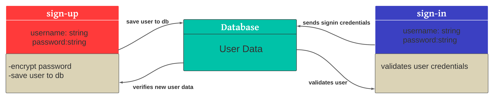

# bearer-auth

## Links and Resources:
 ### Heroku:

* ### Github Actions:

* ### pull request :

## Setup 
### .env requirements :
* ### PORT=3000
* ### POSTGRESQL_URI

## Dependencies needs to install
* ### npm init -y
* ### npm i dotenv express cors 
* ### npm i -D jest supertest 
* ### npm i sequelize 
* ### npm i sqlite3
* ### npm i pg

## To Run the Application
* ### clone the repository
* ### run the command (nodemon)

 ## Testing

### Run tests with :
 * ### npm run test

* UML

